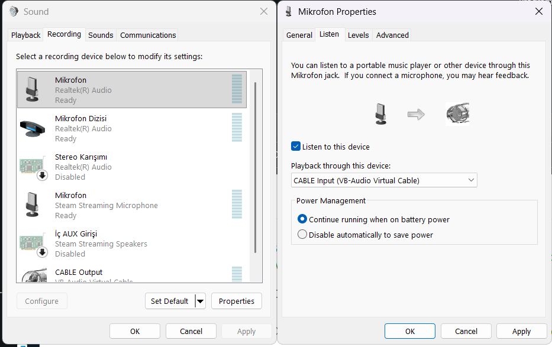
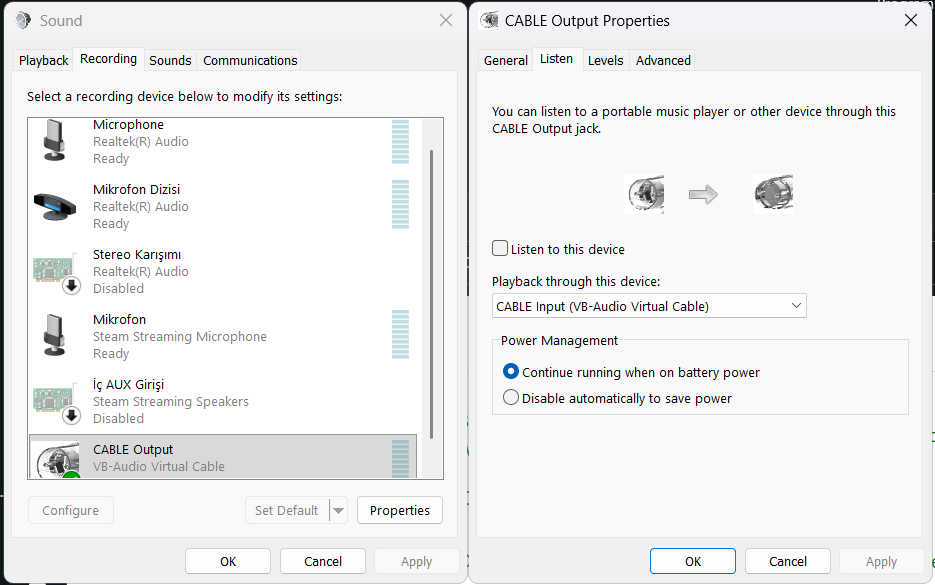
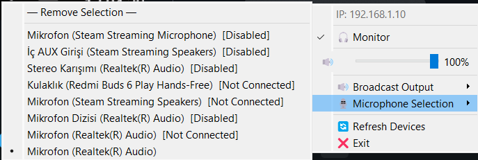

# PadSound - Mobile Controlled PC Soundboard

## 📥 [Download Latest Installer](https://github.com/demirsdev-sys/PadSound/releases/latest)

PadSound is a low-latency soundboard system that allows you to play audio files on your PC via an Android device. It uses virtual audio routing to broadcast both your microphone and soundboard audio through communication apps like Discord, TeamSpeak, or OBS.

## Features

- High-speed UDP command protocol.
- TCP-based automatic file synchronization: If a sound is missing on the PC, it is requested and transferred from the phone automatically.
- Multi-channel support: Play multiple sounds simultaneously.
- System Tray Integration: Runs in the background with easy access to settings.
- Audio Output Selection: Choose between different output devices.
- Custom Images: Support for adding icons/images to sound buttons.

## Requirements

- Windows PC (Server)
- Android Device (Controller)
- VB-Audio Virtual Cable (Strictly Required)

## Installation and Audio Configuration

### 1. PC Server Setup
- Install VB-Audio Virtual Cable("https://vb-audio.com/Cable/").
- Run `PadSound_Installer.exe`.
- Right-click the PadSound icon in the system tray and set **"Broadcast Output"** to **"CABLE Input"**.

### 2. Windows Audio Routing (Critical)
To ensure your voice and the soundboard play together, you must route your microphone to the virtual cable:

1. Open **Windows Sound Settings** > **Control Panel** > **Recording** tab.
2. Right-click your **Main Microphone** and select **Properties**.
3. Go to the **Listen** tab.
4. Check **"Listen to this device"**.
5. In the **"Playback through this device"** dropdown, select **CABLE Input (VB-Audio Virtual Cable)**.

6. **Note:** Ensure that in the properties of **CABLE Output**, the **"Listen to this device"** option is **Unchecked**. This prevents feedback loops and echoes.

7. Choose Your Microphone

### 3. Application Settings
- In Discord, OBS, or Zoom, set your **Input Device (Microphone)** to **CABLE Output**.

### 4. Android App
- Install the PadSound in Play Store.
- Ensure both PC and Phone are on the same Wi-Fi network.
- Enter the Local IP address shown in the PC Tray Menu.
- Click **"Connect and Start"**.

## Usage

- **Adding Sounds:** Use the '+' button in the app to import MP3 files.
- **Playing:** Tap any button to trigger the sound on your PC.
- **Managing:** Long-press any button to rename, delete, or assign a custom image.

## Technical Stack

- **Server:** Python 3.11 · PyQt5 · pygame (SDL2) · sounddevice · soundfile · PyInstaller · Windows Audio Session API (WASAPI) · VB-Audio Virtual Cable

- **Mobile:** Java · Android SDK 21+
  - **UI** — RecyclerView · GridLayoutManager · MaterialCardView · ValueAnimator
  - **Network** — UDP (DatagramSocket) · TCP (Socket) · FileSender
  - **Storage** — SharedPreferences · ContentResolver · PersistableUriPermission
  - **Media** — MediaMetadataRetriever · MediaPlayer
  - **Libs** — uCrop · Gson · AdMob (Banner + Interstitial)
  - **System** — ActivityResultLauncher · OnBackPressedDispatcher

## Developer
Developed by Furkan Demir (Demirsdev).
